# Knob Spotify Player

A Spotify appliance — and a Teams meeting controller — for the **Waveshare
ESP32-S3-Knob-Touch-LCD-1.8**: a 360×360 round touchscreen you turn.

<p align="center">
  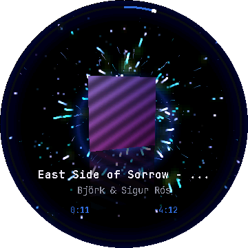
  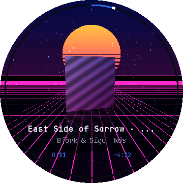
  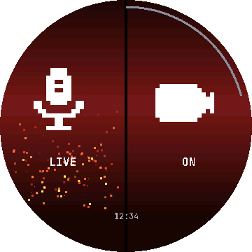
</p>

Album art floats in 3D over a beat-reactive particle field, a ring around the
bezel tracks the track, the knob is the volume, swiping up gets your playlists —
and when a Teams call starts, the screen becomes two giant buttons you can hit
without looking.

**Every screenshot in this README is a real frame from the firmware**, rendered
by `tools/capture_gallery.sh`. The desktop build runs the same source at the same
360×360 with simulated fixed-step time, so the gallery regenerates
byte-identically unless the rendering actually changed. No mockups, no photos.

## The effects

Seven, switchable from the device, all driven by one `Modulation` struct.

<table>
<tr>
<td align="center"><br><b>Cover Light</b><br><sub>comets from behind the album</sub></td>
<td align="center">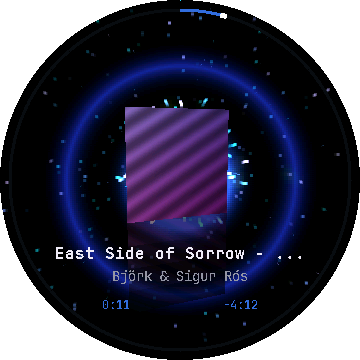<br><b>Heartbeat</b><br><sub>lub-DUB, two rings per beat</sub></td>
<td align="center">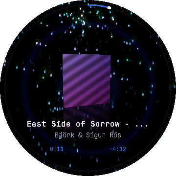<br><b>Rain</b><br><sub>falls; does not burst</sub></td>
<td align="center">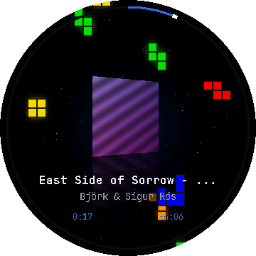<br><b>Tetris</b><br><sub>pieces rotate on the beat</sub></td>
</tr>
<tr>
<td align="center"><br><b>Outrun</b><br><sub>grid runs at the viewer</sub></td>
<td align="center">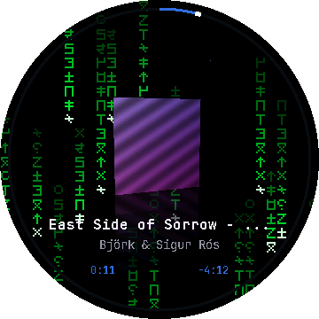<br><b>Matrix</b><br><sub>glyphs scramble on onset</sub></td>
<td align="center">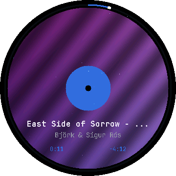<br><b>Record</b><br><sub>the cover as vinyl, spinning</sub></td>
<td align="center">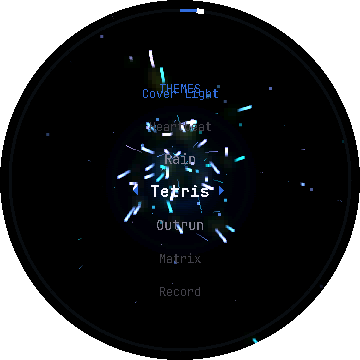<br><b>The picker</b><br><sub>plus Shuffle, which never<br>repeats the current one</sub></td>
</tr>
</table>

A theme is **not** its own renderer. `fx::Particles` is ~38 KB and internal SRAM
is already 56% used, so seven pools would be 266 KB and simply would not fit.
`CoverLight` owns the expensive parts — pool, gradient table, bloom accumulator,
cover quad — and a theme is a small object that steers them. Seven themes cost
about what one does.

## Teams mode

When a call starts the device switches itself, and the panel stops being a
gesture pad and becomes a **button surface**: mic left, camera right, each drawn
in its live state. Tap a half to toggle it. The state display *is* the button, so
there is nothing to memorise mid-meeting.

<table>
<tr>
<td align="center"><br><b>Live</b><br><sub>red, loud, embers rising</sub></td>
<td align="center">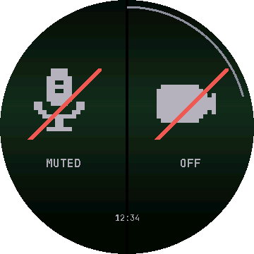<br><b>Muted</b><br><sub>calm green, slashed, still</sub></td>
<td align="center">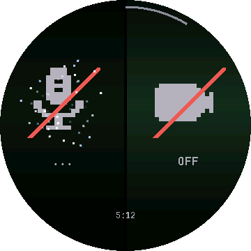<br><b>Pending</b><br><sub>tapped, awaiting Teams' echo</sub></td>
<td align="center">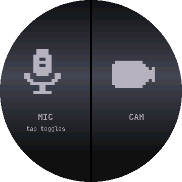<br><b>Unknown</b><br><sub>link down — a grey question</sub></td>
</tr>
</table>

One colour grammar across both halves: **on-air is red, calm is green.** Three
honesty rules, each with a pixel test behind it:

- A live mic is unmissably different from a muted one — the whole screen is the
  across-the-room glance before you speak.
- **Unknown renders as unknown.** A grey question over a hot microphone beats a
  green lie; this is the project's oldest invariant.
- Pending dims and swirls rather than flipping. The display only changes when
  Teams echoes the new truth.

State comes from Teams' own accessibility tree (`tools/axteams`, an
`AXManualAccessibility` unlock and a bounded walk), with a hardware-camera
fallback. Toggles go back as allowlisted keystrokes. The knob still controls
volume mid-call; swipe down returns to the meeting, swipe up leaves it for the
music.

## Everything else

<table>
<tr>
<td align="center">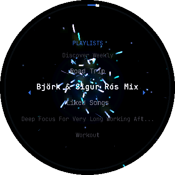<br><b>Playlist browser</b><br><sub>centre-weighted wheel, fitted<br>to the disc's chord</sub></td>
<td align="center">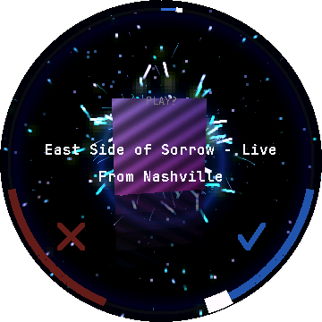<br><b>Save to Liked</b><br><sub>glide left or right to answer</sub></td>
<td align="center"><br><b>Idle</b><br><sub>she wakes when you touch her</sub></td>
<td align="center">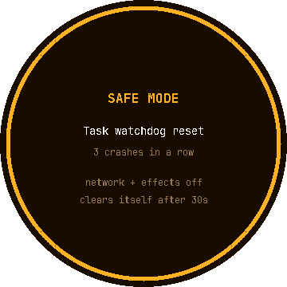<br><b>Safe mode</b><br><sub>three crashes in a row and<br>it stops digging</sub></td>
</tr>
</table>

- **Live album artwork** downloaded into PSRAM and decoded by the chip's ROM JPEG
  decoder. No SD card required.
- **Beat reactivity** — real FFT, spectral-flux onset detection and tempo
  tracking — with a procedural fallback that crossfades in when the room goes
  quiet, so it never freezes. *(The board's mic is not wired yet; the fallback is
  what actually runs on hardware today.)*
- **Screen dim and sleep**, driven by playback and by the Mac's lock state.
- **A watchdog and a crash policy.** Three abnormal resets in a row boots into
  safe mode with network and effects off, and it forgives the streak only after a
  run long enough to count as real.

## Controls

| Gesture | Player | Browser | Meeting |
|---|---|---|---|
| Turn knob | volume, haptic tick per detent | scroll the wheel | volume |
| Tap | play / pause | open playlist / play track | toggle that half |
| Swipe left / right | previous / next track | — | — |
| Swipe up | playlist browser | — | leave, back to music |
| Swipe down | queue *(the meeting, if in a call)* | back a level | — |
| Long press | save to Liked Songs | — | — |

The knob's *press* is not wired to the ESP32-S3 — see
[docs/BOARD_REFERENCE.md](docs/BOARD_REFERENCE.md) §2 — so selection is a tap.

## Quick start

```sh
brew install platformio sdl2 pkg-config     # one time, macOS
export HOMEBREW_PREFIX=/opt/homebrew        # Apple Silicon, every pio command

# Spotify credentials. Run in a real terminal: it prompts for the sensitive
# values itself and writes src/config/secrets.h mode 0600.
python3 tools/get_refresh_token.py

pio run -e esp32 -t upload && pio device monitor
```

The boot banner reports reset reason, crash streak, PSRAM total **and largest
free block**, and the Spotify scopes actually granted. It is the first thing to
read when anything misbehaves — a missing scope shows up there and nowhere else.

### Spotify app setup

A free developer app at <https://developer.spotify.com/dashboard>. Notes that
save an afternoon:

- **Development Mode allows 5 users.** Add each listener's email under User
  Management.
- The **app owner needs active Premium**, or playback control returns 403.
- The token needs `playlist-read-private` for the browser. `get_refresh_token.py`
  requests it; a token issued before the browser existed will not have it, and
  `/me/playlists` answers 403 with no explanation.
- Post-February-2026 apps must use `/me/library` rather than `/me/tracks`. This
  firmware already does.

## The desktop build

Not a mockup — the same source, rendering at the real 360×360, and where the
visuals are actually developed.

```sh
pio run -e native && ./.pio/build/native/program
tools/capture_gallery.sh          # regenerate every image in this README
```

| Variable | Effect |
|---|---|
| `KNOB_SCREEN=<name>` | `player` (default), `list`, `themes`, `teams`, `daisy`, `confirm`, `safe` |
| `KNOB_THEME=<0-6>` | which effect drives the player view |
| `KNOB_TEAMS=<m,c,s>` | meeting state: muted, camera, seconds in call (−1 = unknown) |
| `KNOB_TEAMS_PENDING=mic\|cam` | draw that half mid-toggle |
| `KNOB_HEADLESS=1` | no window; render, dump, exit |
| `KNOB_EXIT_MS=<ms>` | quit after this much *simulated* time |
| `KNOB_DUMP=<path>` | write the framebuffer as a 24-bit BMP |
| `KNOB_BANDS=1` | composite in bands, exactly as the device does |
| `KNOB_WAV=<path>` | drive the analyser from a WAV instead of the fallback |
| `KNOB_POS=<f>` | scroll position within a list, fractional |
| `KNOB_SEED=<n>` | track seed, which sets hue and tempo |
| `KNOB_NOCOVER=1` | the no-artwork path |
| `KNOB_PARTICLES=0` | disable the particle layer |
| `KNOB_BLOOM=<0-255>` | bloom strength override |

Time is simulated and fixed-step, so a headless run is bit-identical every time.
That is what the pixel assertions rest on.

### The invariant worth knowing about

`KNOB_BANDS=1` renders the way the device does — bands composited separately —
and the result must be **byte-identical** to a single full frame. That one
assertion caught three separate clipping bugs that were invisible otherwise, and
it is what makes the desktop a trustworthy stand-in for the panel.

```sh
pio test -e test                                                  # 302 host tests
cd tools && python3 -m unittest discover -s . -p 'test_*.py'      #  84 helper tests
```

## Architecture

```
src/
  core/       AppState, PlaybackState, merge policy, wrap-safe Deadline,
              deterministic Rng, clamped FrameClock, backlight, crash policy
  net/        NetWorker (FreeRTOS task, core 0), WifiLink, HTTP, HostLink
  spotify/    auth refresh, polling, commands, playlist/track listings
  art/        PSRAM cover cache, ROM JPEG decode, palette extraction
  audio/      mic capture, 512-point FFT, band energy, onset, tempo,
              the Modulation bus and its procedural fallback
  gfx/        Surface, blend ops, band bloom, Quad3D, bitmap text
  fx/         particle pool, the seven themes, the theme picker
  views/      Cover Light, the meeting controller, the idle dog, safe screen
  shell/      radial rings, now-playing text, the wheel list, confirm ring
  input/      PCNT encoder, CST816 touch, gestures, routing, DRV2605 haptics
  platform/   esp32/ and desktop/ behind the same interfaces
tools/        the Mac helper, the Teams accessibility reader, the gallery
```

Three ideas do most of the work:

**No framebuffer.** PSRAM writes cap at 33 MB/s on this board no matter how you
do them, so any full-frame pass over one costs ≥7.45 ms. Instead 20-row bands are
composited in internal SRAM — 181 MB/s with 32-bit stores — and DMA'd straight to
the panel. That cost is never paid at all.

**Effects read one struct.** Every animation input comes from a `Modulation`
struct: three band energies, loudness, an onset flag, a phase-locked beat, track
progress, and a per-track seed. Effects never touch the microphone, playback
state, or a clock. That is what makes the whole renderer deterministic enough to
assert on frame by frame — and what lets a mic that hears nothing degrade into
something that still looks deliberate.

**Radially symmetric effects are free.** The backdrop is a function of radius
alone, so it is one table lookup per pixel however much is happening in it —
which is why the beat shockwaves are rings, and why a train of them costs
nothing. Banding in a radial gradient also runs along iso-radius contours, so
dithering the table *index* rather than the colour breaks it up for a single add.

## Performance

Cover Light, the heaviest view, measured on hardware at ~20 fps:

| Pass | ms/frame |
|---|---|
| backdrop + glow + dither | 11.4 |
| cover quad + reflection | 12.2 |
| particles | 7.9 |
| bloom accumulate | 5.7 |
| bloom blur (90×90) | 4.5 |
| rings | 2.3 |
| byte-swap + DMA | 3.2 |
| text | 0.9 |

Screens without the cover quad and the bloom chain run far faster — the idle and
meeting screens sit above 100 fps. The serial status line carries per-pass timers
permanently, and it is the source of truth; the table above is a snapshot.

Getting there took six rounds of measurement, and **every guess made before
measuring was wrong at least once, in both directions**. The Record backdrop was
23.8 ms before it was 8.2 ms. The Mac helper's "essentially zero" CPU was 1.6%.
The details, and the numbers that constrain any design on this board, are in
[docs/BOARD_REFERENCE.md](docs/BOARD_REFERENCE.md) — written to be copied into
another project as-is.

## The Mac helper (optional)

`tools/mac_link.py` — stdlib only, runs as a LaunchAgent. It carries host state
up (lock state, computer name, system volume, Spotify's now-playing read locally
via AppleScript, and Teams call/mic/camera state) and carries a small
**allowlisted** command back down: set the volume, toggle mute, toggle camera.
Any device→Mac command is a fixed allowlist with typed, range-checked arguments,
never a string the Mac evaluates.

It is entirely optional. Without it the knob is a Spotify player. With it, the
knob turns your Mac's volume, runs your meetings, and stops asking Spotify's API
what is playing every two seconds — which is what exhausted the API quota during
development.

```sh
# 1. A shared secret, in two places. Never commit either.
python3 -c "import secrets; print(secrets.token_urlsafe(24))" > ~/.config/knob-spotify/token
chmod 600 ~/.config/knob-spotify/token
#    Then add the SAME value to src/config/secrets.h as MAC_LINK_TOKEN and
#    reflash. An empty token disables the command channel entirely.

# 2. Run it in the foreground first. A background process is the wrong place to
#    discover a typo.
KNOB_HOST=<device-ip> /usr/bin/python3 tools/mac_link.py

# 3. Install it at login.
sed -e "s|REPLACE_WITH_ABSOLUTE_PATH|$PWD|" \
    -e "s|REPLACE_WITH_DEVICE_HOST|<device-ip>|" \
    tools/com.knobspotify.maclink.plist \
    > ~/Library/LaunchAgents/com.knobspotify.maclink.plist
launchctl load ~/Library/LaunchAgents/com.knobspotify.maclink.plist
tail -f /tmp/knob-maclink.log
```

Two traps worth knowing, both of which cost an afternoon:

- **Give `KNOB_HOST` the IP first**, name second. The device's mDNS answers in
  ~5.4 s and *succeeds*, so a `.local`-first host list silently taxes every beat
  with no error and no log.
- **macOS TCC grants bind to the binary's signature.** Every rebuild of a
  compiled helper voids them silently while `AXIsProcessTrusted()` still returns
  true; after a rebuild you must remove and re-add the row, not toggle it.

Measured cost while running: **0.4% CPU, ~25 MB**. It spends almost all its life
asleep on a socket read the device holds open.

## Not done yet

- The board's microphone is not wired to I²S, so beat reactivity runs on the
  procedural fallback on hardware. The FFT, onset and tempo code is built and
  tested.
- No setup portal, so credentials come from a compiled `secrets.h`.
- `axteams` matches English Teams labels only.
- Text is Latin-1; CJK renders a fallback glyph.

## License

MIT. Descended from an M5Stack Spotify controller — the state model, network task
and Spotify client came across nearly unchanged. Everything you can see was
rebuilt, because the two constraints that shaped the original's rendering (no
PSRAM, no microphone) do not exist on this board.
